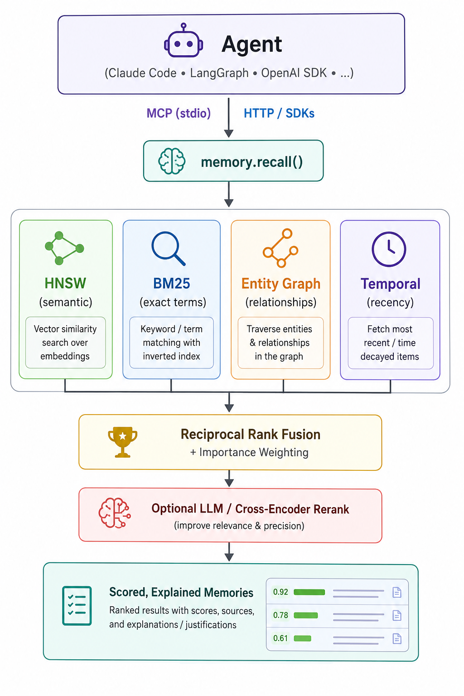
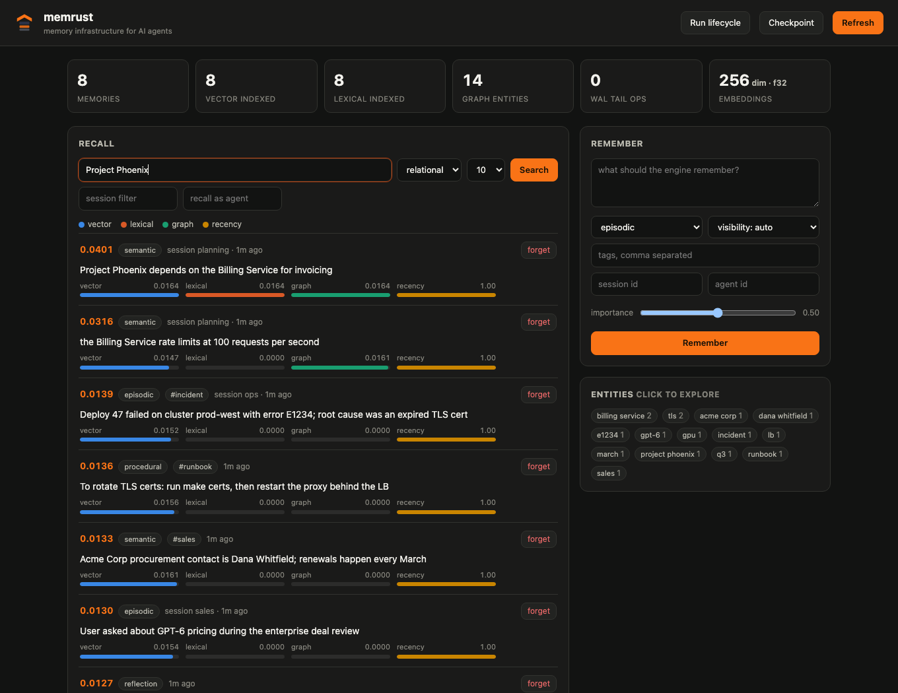
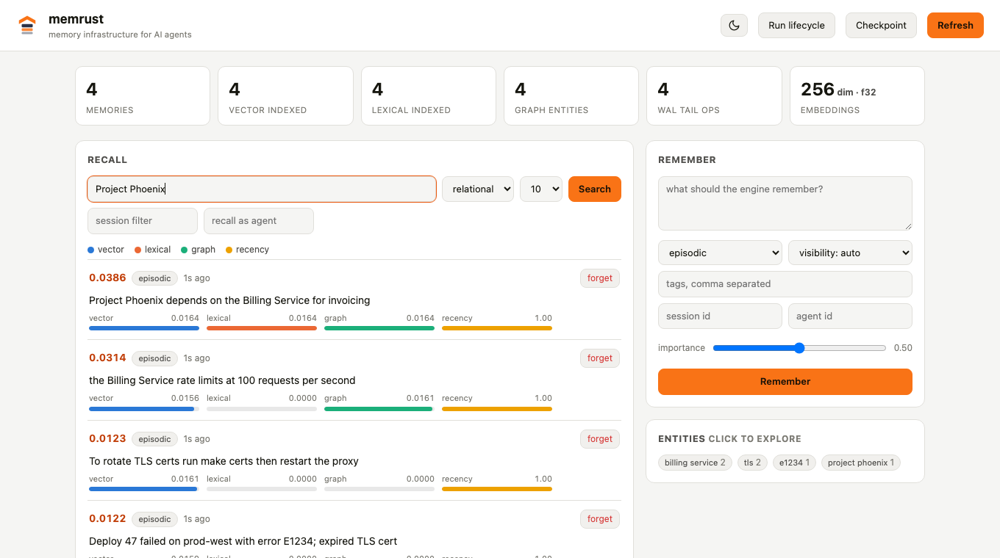

<p align="center">
  
</p>

# memrust

**Memory infrastructure for AI agents — an agent-native memory engine, written in Rust.**

[](https://crates.io/crates/memrust)
[](https://pypi.org/project/memrust/)
[](https://www.npmjs.com/package/memrust-client)
[](https://hub.docker.com/r/aianytime/memrust)
[](LICENSE)

📖 **[Documentation](https://aianytime.github.io/memrust/docs/)** — quickstart in
four languages, the full HTTP API, MCP setup for Claude Code and Cursor,
LangGraph and CrewAI recipes, embeddings, lifecycle and operations.

Not another vector database. Vector DBs answer `query(vector) -> top_k chunks`.
Agents need something different: a memory system that speaks their language
(`remember` / `recall` / `forget`), retrieves across multiple signals at once
(meaning, exact terms, time, importance), explains *why* each memory surfaced,
and plugs directly into agent runtimes via MCP.

<p align="center">
  
</p>

## Why hybrid retrieval matters for agents

Pure vector search is where agent memory goes to die quietly:

- Ask for `error E1234` or `INC-90312` and cosine similarity shrugs — exact
  identifiers need a lexical index (BM25).
- Ask "what did we decide recently?" and embeddings don't know what *recently*
  means — you need time-decay as a first-class ranking signal.
- Ask about "Project Phoenix" and pure similarity misses the memory about the
  billing service Phoenix depends on — *related* is not *similar*. The entity
  graph links memories that share or co-mention entities and traverses it as
  a third retrieval signal (1-hop expansion).
- Get 10 results with opaque scores and the agent can't tell a strong semantic
  match from a lucky keyword hit — memrust returns the per-signal breakdown
  (`vector`, `lexical`, `graph`, `recency`, `importance`, `rerank`) with
  every hit.

## What's inside (all hand-rolled, no search-engine dependencies)

| Component | Implementation |
|---|---|
| Durability | JSON-lines WAL, fsync on append; recovery is checkpoint + WAL tail — the built indexes are serialized (atomic temp+rename) and restarts replay only post-checkpoint ops; auto-checkpoint bounds tail length |
| Vector index | In-crate HNSW (M=16, ef=100/200) with the paper's diversity-based neighbor selection, contiguous flat vector storage, multi-accumulator SIMD-friendly dot kernels; SQ8 scalar quantization (1 byte/dim, distances computed on the codes) applied automatically at >=1024 dims |
| Lexical index | In-crate BM25 (k1=1.2, b=0.75) inverted index |
| Entity graph | Heuristic extraction at ingest (names, identifiers, caps terms, tags); entity→records map + co-occurrence edges; 1-hop rarity-weighted traversal as a retrieval signal — no external graph DB |
| Fusion | Reciprocal-rank fusion over three legs + exponential recency decay (1-week half-life) + importance boost; pre-filtering inside every index (filters applied during traversal/accumulation, not post-hoc) |
| Reranking | Optional `Reranker` stage over the fused pool (`--reranker openai`: any OpenAI-compatible chat model); failures degrade to fused order |
| Embeddings | Pluggable `Embedder` trait: built-in OpenAI-compatible client (OpenAI, Mistral, Voyage, and local sentence-transformers via Ollama / HF TEI / LM Studio / Infinity / vLLM), native Gemini client, BYO precomputed vectors, or the offline feature-hashing default |
| Memory model | `episodic` / `semantic` / `working` / `reflection` / `tool_call` / `procedural`, with tags, sessions, agents, importance |
| Lifecycle | Working-memory TTLs with durable sweeps; automatic consolidation of old episodic memories into semantic summaries (pluggable `Summarizer`: offline extractive default or OpenAI-compatible LLM); session snapshot/restore |
| Interfaces | HTTP API (axum) + MCP server over stdio + embedded web dashboard |
| Operations | Namespaces as isolated engines, API keys with per-namespace scopes, Prometheus `/metrics`, structured JSON logs, unauthenticated `/healthz` liveness probe, official multi-arch Docker image |

## Quickstart

```bash
# Install the engine
cargo install memrust
memrust serve                # dashboard + HTTP API on 127.0.0.1:7700

# ...or run the official image (multi-arch: amd64 + arm64, ~36 MB)
docker run -p 7700:7700 -v memrust-data:/data aianytime/memrust

# Client SDKs
pip install memrust          # Python
npm install memrust-client   # TypeScript

# From source
cargo run -- demo                    # seeded demo: hybrid recall with per-signal scores
cargo run -- serve                   # HTTP API on 127.0.0.1:7700
cargo run -- mcp                     # MCP server on stdio
cargo run --release -- bench         # index benchmark: f32 vs SQ8, clustered vs uniform
cargo test                           # full test suite incl. HNSW-vs-exact recall checks
```

Benchmark on an M-series laptop (n=20k, dim=256, `memrust bench`):

| Data shape | Storage | recall@10 | Search QPS | Vector memory |
|---|---|---|---|---|
| clustered (realistic) | f32 | 1.000 | ~4.6k | 19.5 MB |
| clustered (realistic) | SQ8 | 0.986 | ~5.6k | 5.0 MB |
| uniform (worst case)  | f32 | 0.57 @ ef=100 → 0.91 @ ef=400 | ~2k | 19.5 MB |

Uniform random vectors are the distance-concentration worst case for any ANN
method; real embeddings behave like the clustered rows. `ef_search` is the
accuracy/speed dial.

**Choosing an embedding dimension** (n=6k, clustered, `memrust bench --dim N`):

| Dim | f32 QPS | f32 recall@10 | SQ8 QPS | SQ8 recall@10 | Vectors (f32 → SQ8) |
|---|---|---|---|---|---|
| 384 (MiniLM) | 6,241 | 1.000 | 5,468 | 0.998 | 8.8 → 2.2 MB |
| 1024 (BGE-large, E5-large) | 1,562 | 1.000 | 1,645 | 0.992 | 23.4 → 5.9 MB |
| 1536 (OpenAI v3-small) | 1,001 | 1.000 | 1,006 | 0.996 | 35.2 → 8.8 MB |

Dimension is a capacity ceiling, not a quality dial — retrieval quality comes
from the model's training, not its width, and the cost of width is
superlinear (2.7x the dims cost 4x the throughput here). So prefer 768–1024
unless you've measured a gain from more.

Note the ≥1024 rows: SQ8 is *faster* than f32 there, because memory bandwidth
starts to dominate the extra decode arithmetic. That makes quantization free
at those widths, so **memrust turns it on automatically for vectors ≥1024
dims** and keeps f32 below that. Override with `--quantize` / `--no-quantize`.
The mode is settled by the first vector stored (that is when the width is
known) and is fixed for the life of the collection.

### Namespaces and API keys

Every request selects a namespace with the `X-Memrust-Namespace` header
(default: `default`). **A namespace is a separate engine** — its own indexes,
WAL, checkpoint, embedding dimension and directory — so one tenant's ingest
can't slow another's recall, and dropping a namespace deletes a directory
rather than scanning a shared index.

```bash
# unauthenticated: fine on loopback, and the server says so at startup
memrust serve

# require keys; a key can be scoped to specific namespaces
memrust serve \
  --api-key "$ADMIN_KEY" \
  --api-key "$TENANT_KEY:acme,acme-staging"
```

```bash
curl localhost:7700/v1/recall \
  -H "Authorization: Bearer $TENANT_KEY" \
  -H "X-Memrust-Namespace: acme" \
  -H 'content-type: application/json' \
  -d '{"query":"what did we decide about pricing?"}'
```

A key with no `:namespaces` suffix has access to everything, including the
admin routes `GET /v1/namespaces` and `POST /v1/namespaces/drop`. With no
`--api-key` at all, authentication is disabled — convenient locally, and the
server warns loudly if you do it on a non-loopback address.

Upgrading is safe: a data directory written before namespaces existed is
adopted as the `default` namespace in place, and new namespaces are created
alongside it.

### Metrics and logs

`GET /metrics` serves Prometheus exposition: request counts and latency
histograms by route, plus per-namespace gauges for memories, index sizes,
graph entities and WAL depth. Engine gauges are read live at scrape time, so
they can't drift from reality.

```
memrust_memories{namespace="acme"} 1204
memrust_request_duration_seconds_bucket{route="/v1/recall",le="0.001"} 812
memrust_requests_rejected_total 3
```

Metrics name every namespace, so the endpoint needs an unscoped key when
`--api-key` is set. `--log-format json` emits one JSON object per request for
log shippers; `text` (default) is human-readable and `off` disables it.

`GET /healthz` is a liveness probe that is never authenticated — the detailed
`/health` needs a key once auth is on, and a probe shouldn't hold credentials.

### Docker

`aianytime/memrust` is published for `linux/amd64` and `linux/arm64`, ~36 MB,
running as a non-root user with `/data` as a volume and a `HEALTHCHECK` wired
to `/healthz` (so a container with `--api-key` set still reports healthy).

```bash
docker run -d --name memrust -p 7700:7700 -v memrust-data:/data \
  aianytime/memrust serve --addr 0.0.0.0:7700 --data-dir /data \
  --api-key "$ADMIN_KEY" --log-format json
```

Anything after the image name replaces the default command, so every flag in
this README works there. Tags: `:latest` and exact versions (`:0.6.1`) — pin
the version in production.

### Multi-agent memory

Multiple agents can share one engine while keeping private state private:

- Memories owned by an agent (`agent_id`) default to **private**; set
  `"visibility": "shared"` to publish to the team. Unowned memories are
  shared.
- Recall `as_agent` sees: shared memories, unowned memories, and that
  agent's own private ones. Unscoped recall (no `as_agent`) is the operator
  view and sees everything.
- Visibility is enforced in the pre-filter, inside every index search.
- Consolidation preserves it: a summary is shared only if every source
  memory was shared.

```bash
# each agent mounts the same memory with its own identity
claude mcp add memory -- memrust mcp --data-dir ~/.memrust --agent-id planner
```

### SDKs

Both SDKs are zero-dependency thin clients for `memrust serve`; passing an
agent id scopes the whole client.

```python
# pip install memrust — stdlib only
from memrust import MemrustClient
memory = MemrustClient("http://127.0.0.1:7700", agent_id="planner",
                       api_key=KEY, namespace="acme")
memory.remember("user prefers concise answers", kind="semantic", visibility="shared")
hits = memory.recall("what does the user prefer?", strategy="relational")
```

```typescript
// npm install memrust-client — fetch-based, Node 18+/Bun/Deno/browsers
import { MemrustClient } from "memrust-client";
const memory = new MemrustClient("http://127.0.0.1:7700",
  { agentId: "planner", apiKey: KEY, namespace: "acme" });
await memory.remember("user prefers concise answers", { kind: "semantic" });
const hits = await memory.recall("what does the user prefer?");
```

### Colab notebooks

Three runnable notebooks in [`notebooks/`](notebooks/) — everything installs
with pip and the engine downloads as a single static binary. No API key needed
for the quickstart.

| Notebook | What it covers | |
|---|---|---|
| **01 · quickstart** | install → remember → explained recall → strategies → dashboard, in ~2 minutes | [](https://colab.research.google.com/github/AIAnytime/memrust/blob/main/notebooks/01_quickstart.ipynb) |
| **02 · RAG with embeddings** | sentence-transformers, vector storage, hybrid retrieval, full RAG loop, memory lifecycle | [](https://colab.research.google.com/github/AIAnytime/memrust/blob/main/notebooks/02_rag_with_embeddings.ipynb) |
| **03 · PDF RAG + agents** | pypdf ingestion, a LangGraph agent that writes memories back, multi-agent visibility, the whole feature set | [](https://colab.research.google.com/github/AIAnytime/memrust/blob/main/notebooks/03_pdf_rag_agents.ipynb) |

### Web dashboard

`memrust serve` ships an embedded dashboard at **http://127.0.0.1:7700/** —
no separate install, no external assets. Browse and add memories, run hybrid
recall with the per-signal score breakdown visualized per hit, explore the
entity graph (click an entity to run a relational search), and trigger
lifecycle/checkpoint. Query URLs are shareable: `/?q=Project%20Phoenix&strategy=relational`.

<p align="center">
  
  <br><br>
  
</p>

### Use it as memory for Claude Code

```bash
cargo build --release
claude mcp add memory -- ./target/release/memrust mcp --data-dir ~/.memrust
```

The agent gets three tools: `memory_remember`, `memory_recall`,
`memory_forget` — recall spans all four signals and reports the per-signal
score breakdown to the agent.

### HTTP API

```bash
curl -X POST localhost:7700/v1/remember -H 'content-type: application/json' \
  -d '{"text":"Globex renewed at $120k ARR","kind":"episodic","importance":0.9,"tags":["sales"]}'

curl -X POST localhost:7700/v1/recall -H 'content-type: application/json' \
  -d '{"query":"Globex renewal","strategy":"balanced","top_k":5,
       "filter":{"kinds":["episodic"],"since":1735689600000}}'
```

Pass `ef_search` on a recall to widen the HNSW beam for that query alone —
higher is more accurate and slower, unset uses the index default (100).

Recall strategies: `balanced` (default), `semantic`, `lexical`, `recent`,
`relational` (graph-first: things *connected* to the query's entities) —
they reweight the fusion, they don't switch indexes off, so an exact-ID query
still works under `semantic` and vice versa.

### Embedding models

The default is an offline hash embedder (no API, no weights) so everything
works out of the box. For production quality, plug in a real model:

```bash
# OpenAI
OPENAI_API_KEY=sk-... memrust serve --embedder openai --embedding-model text-embedding-3-small

# Gemini
GEMINI_API_KEY=... memrust serve --embedder gemini --embedding-model gemini-embedding-001

# Any sentence-transformers model, served locally by Ollama / HF TEI /
# LM Studio / Infinity / vLLM — they all speak the OpenAI-compatible protocol:
ollama pull all-minilm
memrust serve --embedder openai --embedding-url http://localhost:11434/v1 --embedding-model all-minilm
```

The engine probes the model once at startup to learn its dimension (and fail
fast on bad keys). The first vector fixes a collection's dimension; mixing
embedding models in one collection is rejected rather than silently broken.
Asymmetric retrieval models (E5 family) get `--embed-query-prefix "query: "
--embed-passage-prefix "passage: "`.
Fully bring-your-own pipelines skip the embedder entirely: pass `embedding`
on remember and `query_embedding` on recall. If a remote embedder is down,
recall degrades to lexical+recency instead of failing.

### As a library

```rust
use memrust::{MemoryEngine, RememberRequest, RecallRequest};

let mut memory = MemoryEngine::open("./data".as_ref())?;
memory.remember(RememberRequest {
    text: "user prefers Rust examples".into(),
    ..Default::default()
})?;
let hits = memory.recall(&RecallRequest {
    query: "what does the user prefer?".into(),
    ..Default::default()
});
```

### Memory lifecycle

Memory that only ever grows is a liability: recall quality degrades, storage
climbs, and stale scratch state pollutes results. The lifecycle pass (runs
every 5 minutes in `serve`/`mcp` by default, or on demand via
`POST /v1/lifecycle/run`) does three things:

- **TTL sweep** — `working` memories expire (default 1 day, or per-memory
  `ttl_seconds`). Expired memories are invisible to recall immediately and
  durably forgotten by the sweep.
- **Consolidation** — episodic memories older than 7 days are grouped per
  session and folded into one semantic summary each (batches of 4–12). The
  summary keeps provenance in `sources`, union of tags, and max importance;
  the originals are forgotten in the same WAL-logged pass, so a crash
  mid-consolidation loses nothing. Summarization is pluggable: the default is
  an offline extractive summarizer (deterministic, never hallucinates);
  `--summarizer openai` upgrades to any OpenAI-compatible chat model
  (OpenAI, or local LLMs via Ollama / LM Studio / vLLM).
- **Snapshots** — `POST /v1/snapshot {"session_id": "..."}` exports a
  session's live memories; `POST /v1/restore` imports them, preserving ids
  (idempotent — restoring twice adds nothing). Move an agent's memory between
  machines, check it into a repo, or fork a session.

```bash
memrust serve --summarizer openai --summarizer-model gpt-4o-mini \
              --working-ttl-secs 3600 --consolidate-after-secs 259200
```

## Design decisions

1. **WAL-first, indexes derived.** Every mutation is one fsynced JSON line.
   Crash anywhere, replay on open, and the HNSW/BM25 state is reconstructed
   exactly. This is the boring-but-correct core a memory product must have
   before any clever ranking.
2. **Deletion is a tombstone, then compaction.** `forget()` is durable
   immediately (agents handle sensitive data; forgetting must be real), and
   `compact()` rewrites the log and rebuilds indexes without the dead weight.
3. **Explainable recall.** Every hit carries its signal decomposition. Agents
   can (and should) reason about *why* a memory surfaced; opaque scores make
   that impossible.
4. **Embeddings are a plugin, not a dependency.** The engine is fully
   functional offline with the hash embedder; production deployments swap in
   a real model via the `Embedder` trait or bring precomputed vectors.

## How it compares

Everything below was measured on one machine (M-series MacBook, macOS) with
the scripts in [`benches/`](benches/) — `compare.py` for speed, `agent_recall.py`
for retrieval quality. Re-run them yourself; the numbers move with hardware.

### Vector search: memrust is competitive, not fastest

20,000 vectors, 384 dims, clustered like real embeddings, top-10, identical
HNSW settings everywhere (M=16, ef_construction=200, ef_search=100). Recall is
against exact brute-force ground truth.

| Engine | Ingest/s | Query p50 | Query p95 | recall@10 |
|---|---|---|---|---|
| FAISS (in-process lib) | 35,625 | **0.06 ms** | 0.08 ms | 1.000 |
| LanceDB (embedded) | **99,238** | 8.60 ms | 9.70 ms | 1.000 |
| Chroma (in-process) | 5,907 | 0.49 ms | 0.57 ms | 1.000 |
| pgvector (server, SQL) | 5,017 | **0.46 ms** | 0.53 ms | 1.000 |
| Qdrant (server, HTTP) | 2,475 | 2.08 ms | 2.73 ms | 1.000 |
| **memrust (server, HTTP)** | 988 | 0.64 ms | 0.75 ms | 1.000 |

Read that honestly. **Query latency is competitive** — second-best among the
servers, and the in-process libraries win partly because they never touch a
socket. **Recall matches everyone at 1.000.** **Ingest is the weak spot**, an
order of magnitude behind: memrust fsyncs every write for crash-safety where
the others buffer. Batch ingest amortizes one fsync per batch (that is what
makes 988/s possible; single-record writes manage ~176/s), but the remaining
cost is HNSW graph construction, not durability — measured by holding fsyncs
constant and varying batch size, where throughput flattens past batch=100.

Ingest figures move run to run — Qdrant measured between 2,475/s and 4,887/s
across runs on the same box. Treat one-significant-figure differences as noise.

If raw ANN throughput on a static corpus is your problem, use FAISS.

### Concurrency

Reads share the engine lock; a write takes it exclusively. 20k vectors, 384
dims, `benches/concurrency.py`:

| Concurrent readers | Writer | QPS | p50 | scaling |
|---|---|---|---|---|
| 1 | – | 487 | 1.83 ms | 1.0x |
| 2 | – | 918 | 1.99 ms | 1.9x |
| 4 | – | 2,006 | 1.93 ms | 4.1x |
| 8 | – | 2,329 | 3.23 ms | 4.8x |
| 4 | yes | 957 | 4.78 ms | — |

Reads scale sub-linearly but usefully. Writes are two-phase: the record is
persisted (including its fsync) while holding only a *read* lock, so
concurrent recalls keep running through the disk flush, and the exclusive
lock is taken afterwards just long enough to make the record visible in
memory. That took reads-under-write from 467 to 957 QPS and halved their
latency.

A writer still costs about half of read throughput, because inserting into
the HNSW graph — real in-memory work, roughly 2 ms — happens under the
exclusive lock. Splitting that further (a concurrent or segmented index)
is open work, and single-writer remains a design constraint.

Correctness note: the two phases are bracketed by a commit lock. Without it a
checkpoint could land between them and truncate the WAL entry for a record
that state does not yet contain, losing an acknowledged write. Verified by
running four writers against a checkpoint loop and then `kill -9`: 1,000
acknowledged writes, 1,000 recovered.

### Agent memory: where the architecture actually matters

500 memories, the same all-MiniLM-L6-v2 embeddings given to every engine, and
two question shapes an agent actually asks. Metric is hit@5 — was the one
correct memory in the top 5?

| Engine | `"INC-90312"` (identifier) | `"how quickly do toggles reach users?"` (paraphrase) |
|---|---|---|
| Exact vector search *(the ceiling)* | 27% | 90% |
| FAISS | 27% | 70% |
| Chroma | 27% | 90% |
| Qdrant | 27% | 90% |
| memrust (semantic-weighted) | 58% | 80% |
| **memrust (hybrid, default)** | **75%** | 80% |

The identifier column is the point. **Exact, brute-force vector search also
scores 27%** — so this is not an index-quality problem that a better ANN
implementation fixes. The embedding simply cannot separate `INC-90312` from
`INC-90319`; they are near-identical strings with near-identical vectors. Any
pure vector store inherits that ceiling. memrust clears it because BM25 and
the entity graph run over the same memories and their rankings are fused.

Agents hit this constantly: error codes, ticket IDs, customer names, function
names, commit SHAs. The usual fix is to bolt a keyword index next to your
vector DB and write fusion code. memrust ships that as the default path.

(Caveat: 60 identifier probes but only 10 paraphrase probes, so treat the
paraphrase column as directional — the spread there is a couple of probes.)

### What you would otherwise assemble

| | memrust | Qdrant | Chroma | FAISS | pgvector | LanceDB |
|---|---|---|---|---|---|---|
| Vector search | ✅ | ✅ | ✅ | ✅ | ✅ | ✅ |
| Keyword/BM25 fused into one query | ✅ built-in | ⚙️ sparse vectors | ❌ substring filter only | ❌ | ⚙️ via `tsvector` | ✅ |
| Entity-graph traversal as a signal | ✅ | ❌ | ❌ | ❌ | ⚙️ via SQL joins | ❌ |
| Per-signal score explanation | ✅ | ❌ | ❌ | ❌ | ❌ | ❌ |
| Agent API (`remember`/`recall`/`forget`, memory kinds) | ✅ | ❌ | ❌ | ❌ | ❌ | ❌ |
| Memory lifecycle (TTL + consolidation) | ✅ | ❌ | ❌ | ❌ | ⚙️ cron + SQL | ❌ |
| Multi-agent private/shared visibility | ✅ | ⚙️ payload filters | ⚙️ metadata filters | ❌ | ⚙️ row policies | ⚙️ filters |
| MCP server for agent runtimes | ✅ | ❌ | ❌ | ❌ | ❌ | ❌ |
| Tenant isolation as separate indexes | ✅ namespaces | ⚙️ collections | ⚙️ collections | ❌ | ⚙️ schemas | ⚙️ tables |
| API keys scoped per tenant | ✅ | ⚙️ single key / JWT | ❌ | ❌ | ✅ SQL roles | ❌ |
| Prometheus metrics | ✅ | ✅ | ❌ | ❌ | ⚙️ exporter | ❌ |
| Built-in web dashboard | ✅ | ✅ | ❌ | ❌ | ❌ | ❌ |
| Embeddable (no server) | ✅ Rust lib | ❌ | ✅ | ✅ | ❌ | ✅ |

✅ built in · ⚙️ possible, you build it · ❌ not available

### So why use memrust?

Because the alternative to one memory engine is a stack: a vector DB, a
keyword index, fusion code, a graph store for relationships, a scheduler for
expiry and summarization, application-level access control, and an MCP shim.
memrust is one binary that does those as its default behavior, and it answers
the question agents actually ask — *"what do I know about this?"* — rather
than *"which vectors are nearest?"*

**Do not use memrust if** you need maximum ANN throughput on a large static
corpus (FAISS), you are already deep in Postgres and only need embeddings
(pgvector), or you need billion-scale distributed sharding today (Qdrant,
Milvus). memrust is young — single-node, one writer — and it is honest about
that.

## Project layout

```
src/
  engine.rs        remember/recall/forget, fusion, lifecycle, checkpoints
  index/vector.rs  HNSW (+ SQ8 quantization, filtered search)
  index/text.rs    BM25 inverted index
  index/graph.rs   entity extraction + co-occurrence graph
  embed.rs         Embedder trait, OpenAI-compatible + Gemini clients
  summarize.rs     Summarizer trait (extractive + LLM)
  rerank.rs        Reranker trait (LLM)
  store.rs         WAL + checkpoint persistence
  server/http.rs      HTTP API + embedded dashboard
  server/tenancy.rs   namespace registry, API keys, scopes
  server/metrics.rs   Prometheus exposition + request logging
  server/mcp.rs       MCP server over stdio
sdks/
  python/          zero-dependency Python client + E2E test
  typescript/      zero-dependency TypeScript client + E2E test
benches/           cross-engine comparison scripts (see benches/README.md)
notebooks/         three runnable Colab notebooks
docs/              landing page (self-contained HTML, served by GitHub Pages)
```

## Development

```bash
cargo fmt --check && cargo clippy --all-targets -- -D warnings && cargo test
```

49 tests cover the engine, lifecycle, scale/recovery, graph recall, multi-agent
visibility and tenancy. CI (GitHub Actions) runs the command above plus both
SDK E2E suites against a built server and a Docker image build. Tags matching
`v*` trigger the release workflow: binaries for Linux/macOS, crates.io, PyPI
and npm publishes (with the corresponding repository secrets configured).

## Roadmap to a product

- **v0.2 — memory lifecycle:** ✅ working-memory TTLs, automatic consolidation
  of old episodic memories into semantic summaries, session snapshots.
- **v0.3 — scale:** ✅ checkpoint + WAL-tail recovery (serialized indexes, no
  rebuild on restart), SQ8 quantization, contiguous vector storage with
  SIMD-friendly kernels, diversity-heuristic HNSW neighbor selection, batch
  embedding (`/v1/remember_batch`), `bench` subcommand. Still open: mmap'd
  zero-copy segments and a binary checkpoint format.
- **v0.4 — retrieval quality:** ✅ entity graph as a third retrieval leg
  (extraction at ingest, co-occurrence edges, 1-hop traversal), pre-filtering
  inside HNSW and BM25, optional LLM reranking, `procedural` memory kind,
  asymmetric query/passage embedding prefixes. Still open: LLM-based entity
  extraction, hierarchical (RAPTOR-style) summarization.
- **v0.5 — multi-agent + SDKs:** ✅ private/shared visibility with per-agent
  recall scoping enforced in the pre-filter, MCP `--agent-id` identity
  stamping, zero-dependency Python and TypeScript SDKs, per-query `ef_search`,
  two-phase writes so recalls run through a writer's fsync.
- **v0.6 — production:** ✅ namespaces as fully isolated engines with
  backward-compatible adoption of pre-namespace data directories, API keys
  with per-namespace scopes and constant-time comparison, Prometheus
  `/metrics` with live per-namespace gauges, JSON request logs, unauthenticated
  `/healthz`, official multi-arch Docker image. Still open: scheduled
  backup/restore to object storage.
- **Beyond:** read replicas via WAL streaming, and a concurrent or segmented
  vector index to lift the single-writer ceiling — both demand-driven, not
  scheduled.
- **Cloud:** hosted memory with per-tenant isolation — the open-core business:
  the engine stays Apache-2.0, the multi-tenant control plane is the product.

## License

Apache-2.0.
